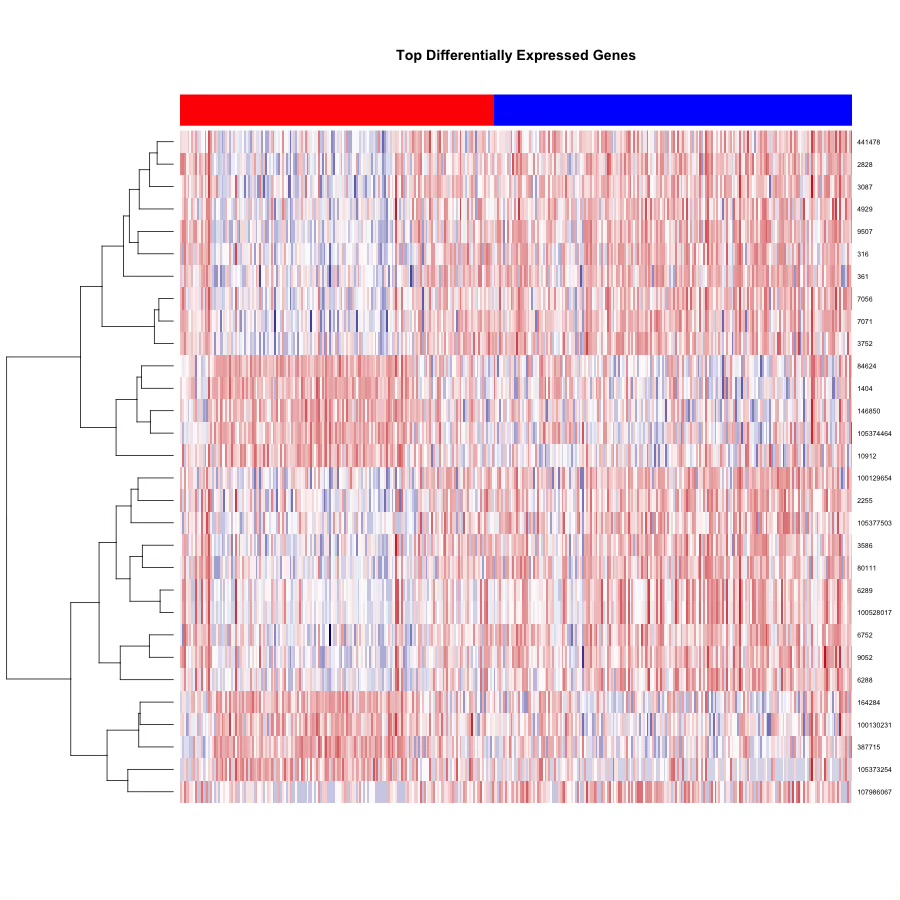

# RNAseq-DCM-GeneExpression-Analysis
RNA-seq analysis of dilated cardiomyopathy (DCM) vs control heart samples using GEO dataset GSE141910. Includes PCA, UMAP, volcano plot, and heatmap visualizations in R.

# Introduction
Dilated cardiomyopathy (DCM) is a condition in which the heart becomes enlarged and weakened, reducing its ability to pump blood effectively. As the left ventricle dilates, the force of contraction decreases, leading to impaired circulation of oxygen-rich blood throughout the body. Over time, this can progress to systolic heart failure, where the heart is no longer able to meet the body’s demands. DCM is one of the leading causes of heart failure worldwide and is a major reason for heart transplantation. Unlike many cardiovascular diseases, it can affect individuals at relatively young ages, not just older adults, making its impact particularly significant.

Once symptoms begin to appear, the disease can progress rapidly in some patients. Individuals with DCM are at increased risk for complications such as fluid overload, reduced exercise tolerance, and dangerous arrhythmias. These arrhythmias can lead to sudden cardiac death, even in patients who may not have severe symptoms beforehand. Mortality rates remain high, especially in cases where diagnosis is delayed or access to advanced therapies is limited. Because of its severity, variability in progression, and impact on quality of life, DCM continues to be an important focus of both clinical and translational research.

The causes of DCM are complex and often multifactorial. Genetic mutations affecting structural proteins of the heart muscle are a major contributor, but environmental factors such as viral infections, toxins, and chronic conditions like hypertension can also play a role. In many cases, the exact cause remains unknown, which limits the ability to predict disease progression or develop targeted therapies. This uncertainty highlights the need for research that goes beyond clinical presentation and examines the underlying biological mechanisms driving the disease.

In this project, we focus on understanding DCM at the molecular level using RNA sequencing (RNA-seq) data. Rather than only observing clinical outcomes, this approach allows us to analyze gene expression patterns in heart tissue and identify which genes and pathways are altered in DCM compared to non-failing hearts. By examining differential gene expression, we can uncover key biological processes such as inflammation, metabolic dysfunction, and structural remodeling that contribute to disease progression. Overall, this project aims to provide deeper insight into the molecular basis of DCM and support future efforts toward more precise, targeted, and personalized treatment strategies.

# Research Question
Which genes and molecular pathways differ between males and females with dilated cardiomyopathy (DCM) compared to non-failing hearts?

# Hypothesis
DCM hearts exhibit distinct gene expression and pathway profiles compared to non-failing hearts, characterized by increased inflammatory signaling and activation of cardiac remodeling programs, with these effects being more pronounced in males than in females. 

# RNA-seq Analysis of Dilated Cardiomyopathy (DCM)

This project analyzes RNA-seq gene expression data from the GEO dataset **GSE141910** to identify differential gene expression between **Dilated Cardiomyopathy (DCM)** and **Non-failing human hearts**. Furthermore, this project will evluate if these transcriptomic differences are **sex-specific**.  

# Dataset: GSE141910

**RNA sequencing of the left ventricle from non-failing donors and heart failure samples from the MAGNet consortium**

Human left ventricular RNA-seq data. Includes non-failing hearts and multiple cardiomyopathy subtypes (including DCM)
n = 305
- 152 patients with non-failing donors
    - 70 Males
    - 82 Females
- 153 patients with dilated cardiomyopathy
    - 92 Males
    - 61 Females
- Overall sex distribution:
    - 53% Male / 47% Female
 
**GEO Accession:**
https://www.ncbi.nlm.nih.gov/geo/query/acc.cgi?acc=GSE141910

## Methods

The analysis pipeline includes:

- Data filtering of low-count genes
- Log transformation of counts
- Principal Component Analysis (PCA)
- UMAP dimensionality reduction
- Differential gene expression analysis using **limma**
- Volcano plot visualization
- Heatmap of top differentially expressed genes

## Visualizations

### PCA Plot

### UMAP Plot

### Volcano Plot

### Heatmap

## Tools Used

- R
- GEOquery
- limma
- umap
- data.table

## Author

Vaishnavi Madagiri  
Bioinformatics Major — Virginia Commonwealth University

Ammar Mohiuddin
Biology and Bioinformatics Major - Virginia Commonwealth University 
